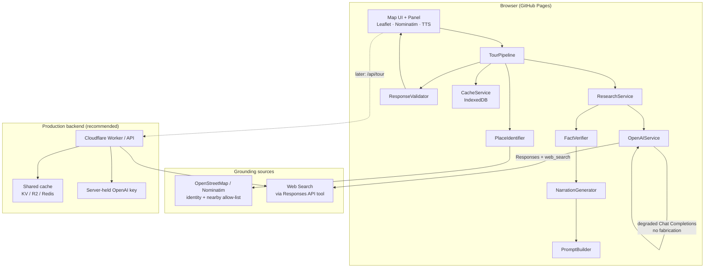
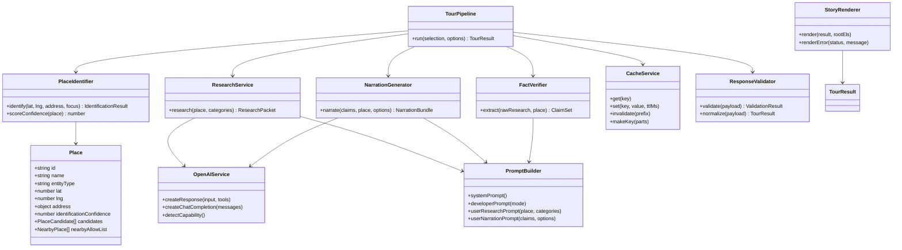
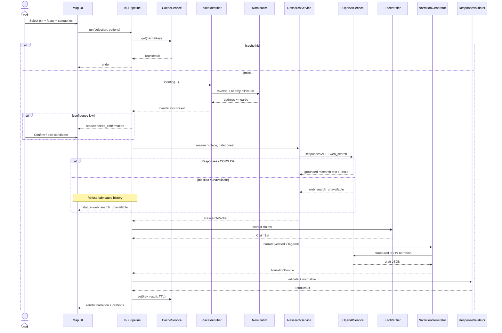

# GuidedCityTour — Hallucination-Resistant AI Architecture

**Version:** 2.0.0  
**Principle:** The LLM is a **narration and reasoning engine**, never the source of truth. Historical claims shown as verified must carry sources. Prefer official / institutional sources (UNESCO, city sites, museums, heritage registries, universities, tourism boards, archives). Avoid blogs when better sources exist.

**Hosting reality:** The live app is static GitHub Pages (`https://spirea89.github.io/GuidedCityTour/`). Cross-user cache and reliable `web_search` typically need a small backend (Cloudflare Worker / serverless). This document defines **production interfaces** and a **client modular path** that works with a user-supplied OpenAI key (IndexedDB cache). Secrets never live in the repo.

---

## Related docs

| Doc | Purpose |
|-----|---------|
| [ai/prompts.md](./ai/prompts.md) | System / developer / user prompt templates |
| [ai/json-schema.md](./ai/json-schema.md) | Structured tour response JSON schema |
| [ai/implementation-plan.md](./ai/implementation-plan.md) | Complete implementation + step-by-step refactor |
| [ai/backend-interfaces.md](./ai/backend-interfaces.md) | Production Worker API, CORS, cost, safety |
| [ai/code-examples.md](./ai/code-examples.md) | Code examples for every component |
| [../workers/README.md](../workers/README.md) | Cloudflare Worker stub & deploy notes |

---

## 1. Overall architecture



### Pipeline stages (critical)

1. **Identification** — OSM reverse geocode + entity typing + confidence. Low confidence → ask user to confirm; **do not invent history**.
2. **Research** — Responses API + `web_search` with authoritative-source preference.
3. **Fact extraction** — Split claims into verified / uncertain / legends / unknown; each verified claim has confidence + sources.
4. **Narration** — Adult narration **only** from verified claims (+ clearly labeled legends section if present).
5. **Kids mode** — Simpler language from **verified only**; no invented stories.

---

## 2. Folder structure

```
map-explorer/
├── index.html                 # Shell: map chrome, panel, modals; loads js/app.js
├── README.md
├── docs/
│   ├── AI_ARCHITECTURE.md     # This file
│   └── ai/
│       ├── prompts.md
│       ├── json-schema.md
│       ├── implementation-plan.md
│       └── backend-interfaces.md
├── js/
│   ├── config.js
│   ├── app.js                 # Map, geolocation, panel wiring, TTS
│   ├── models/
│   │   ├── place.js           # Generic Place / POI model
│   │   └── tourResult.js
│   ├── schemas/
│   │   └── tourResponseSchema.js
│   ├── services/
│   │   ├── CacheService.js
│   │   ├── OpenAIService.js
│   │   ├── PromptBuilder.js
│   │   ├── ResponseValidator.js
│   │   ├── PlaceIdentifier.js
│   │   ├── ResearchService.js
│   │   ├── FactVerifier.js
│   │   ├── NarrationGenerator.js
│   │   └── TourPipeline.js    # Orchestrator
│   └── ui/
│       └── storyRenderer.js
└── workers/
    └── README.md              # Future proxy + shared cache
```

---

## 3. Class / component diagram



---

## 4. API flow (sequence)



---

## 5. Prompt templates

Full templates live in [ai/prompts.md](./ai/prompts.md). Summary:

| Role | Job |
|------|-----|
| **System** | Tour guide persona + hard rules: never invent facts; verified needs sources; OSM allow-list for “nearby”; uncertainty labeling |
| **Developer** | Pipeline mode (`identify` / `research` / `narrate` / `kids`), JSON schema reminder, authoritative source preference |
| **User** | Place payload (coords, address, entity type, allow-list), selected categories, focus kind, kids flag |

---

## 6. JSON schema

Full schema: [ai/json-schema.md](./ai/json-schema.md). Top-level shape:

- `status` — pipeline outcome enum (ok, needs_confirmation, unidentified, no_history, source_conflict, ambiguous_name, offline, web_search_unavailable, error)
- `place` — generic Place/POI (supports buildings, museums, statues, churches, castles, restaurants, trails, landmarks, streets, neighbourhoods)
- `claims.verified | uncertain | legends | unknown`
- `narration.adult | kids | sections{}`
- `citations[]`
- `meta` — model, cache, pipeline version, research mode

---

## 7–8. Implementation & refactoring plans

See [ai/implementation-plan.md](./ai/implementation-plan.md) for the complete plan and ordered refactor steps.

---

## 9. Production recommendations

| Topic | Static Pages (today) | Production (recommended) |
|-------|----------------------|---------------------------|
| API key | User `localStorage` | Server-held key; optional user BYOK |
| Web search | Try Responses from browser; often CORS-blocked | Worker proxies Responses + `web_search` |
| Cache | Per-browser IndexedDB | Shared KV keyed by place+categories |
| Rate limits | Per user key | Worker rate limit per IP / session |
| Cost | User pays OpenAI | You pay; cache aggressively; economy model for kids |
| Safety | Prompt + schema validation | Same + server-side schema check + audit log |
| Secrets | Never in repo | Worker secrets / env only |

Details: [ai/backend-interfaces.md](./ai/backend-interfaces.md).

---

## 10. Code examples

Runnable modules live under `js/`. Illustrative snippets:

### Place model

```js
import { createPlace, ENTITY_TYPES } from "./models/place.js";

const place = createPlace({
  name: "Stephansdom",
  entityType: ENTITY_TYPES.CHURCH,
  lat: 48.2084,
  lng: 16.3731,
  identificationConfidence: 0.92,
});
```

### Pipeline entry

```js
import { TourPipeline } from "./services/TourPipeline.js";

const pipeline = new TourPipeline({ apiKey, model });
const result = await pipeline.run(selection, {
  categories: ["history", "architecture", "today"],
  kidsMode: false,
});
```

### Cache key + TTL

```js
const key = cache.makeKey({
  lat: round(lat, 5),
  lng: round(lng, 5),
  focus: focus.id,
  categories: categories.sort().join(","),
  kids: kidsMode ? 1 : 0,
  v: "2.0.0",
});
await cache.set(key, result, 7 * 24 * 60 * 60 * 1000); // 7 days
```

### Validation gate

```js
const { ok, errors, normalized } = validator.validate(raw);
if (!ok) throw new Error("Invalid tour JSON: " + errors.join("; "));
```

---

## Error states (UI contract)

| Status | User-facing behavior |
|--------|----------------------|
| `unidentified` | Could not identify a named place; ask to move pin or search |
| `needs_confirmation` / `ambiguous_name` | Show candidate list; block narration until confirm |
| `no_history` | Honest empty history; optional atmosphere from OSM only (labeled) |
| `source_conflict` | Show conflicting claims; do not pick a winner silently |
| `offline` | Network unavailable |
| `web_search_unavailable` | Research blocked (often CORS); **refuse fabricated history**; show Worker recommendation |
| `error` | Generic failure with actionable message |

---

## Caching policy

| Item | Rule |
|------|------|
| **Key** | `gct:v2:{lat5}:{lng5}:{focusId}:{cats}:{kids}` |
| **TTL** | 7 days default (client); 30 days shared cache for famous POIs server-side |
| **Invalidation** | Bump pipeline version in key; `CacheService.invalidate("gct:v2:")` on schema break; manual clear in settings (future) |
| **Do not cache** | `error`, `offline`, `web_search_unavailable`, `needs_confirmation` |

---

## Future entity types

`Place.entityType` is an open enum. Identification maps OSM `tourism` / `historic` / `amenity` / `building` / `leisure` tags → `museum | statue | church | castle | restaurant | trail | landmark | building | street | neighbourhood | unknown`. Prompts and schema stay entity-agnostic; only tag → type mapping and research query hints specialize.
