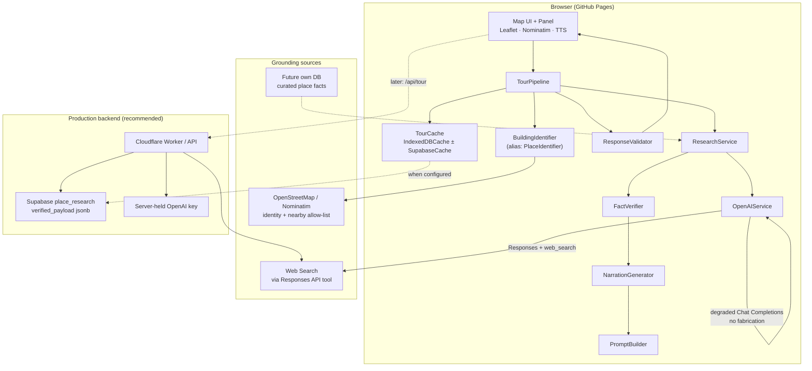
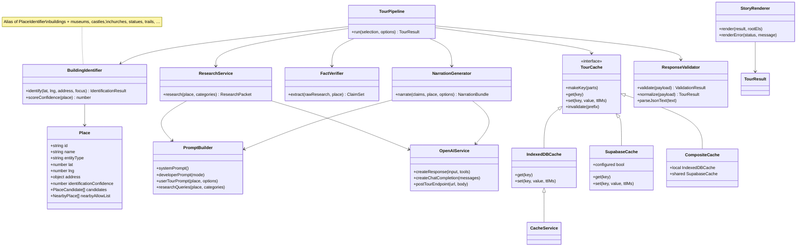
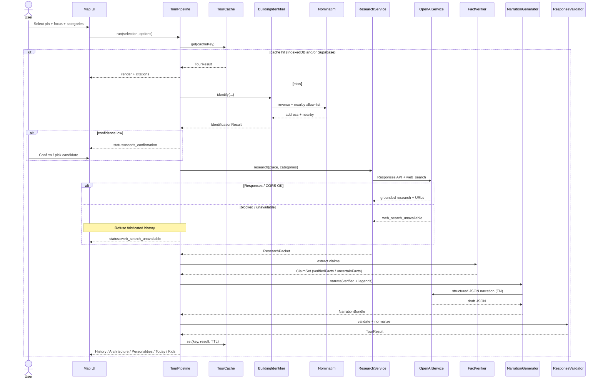

# GuidedCityTour — Hallucination-Resistant AI Architecture

**Version:** 2.1.0  
**Principle:** The LLM is a **narration and reasoning engine**, never the source of truth. Historical claims shown as verified must carry sources. Prefer official / institutional sources (UNESCO, city sites, museums, heritage registries, universities, tourism boards, archives). Avoid blogs when better sources exist.

**Hosting reality:** The live app is static GitHub Pages (`https://spirea89.github.io/GuidedCityTour/`). Cross-user cache and reliable `web_search` need a small backend (Cloudflare Worker) plus **Supabase** (or KV) for shared verified payloads. This document is the **master architecture** for deliverables 1–9. Secrets never live in the repo.

---

## Related docs (appendices)

| Doc | Purpose |
|-----|---------|
| [ai/prompts.md](./ai/prompts.md) | **§5** System / developer / user prompt templates |
| [ai/json-schema.md](./ai/json-schema.md) | **§6** Structured tour response JSON schema |
| [ai/implementation-plan.md](./ai/implementation-plan.md) | **§7** Implementation + refactoring plan |
| [ai/code-examples.md](./ai/code-examples.md) | **§8** Sample code for major components |
| [ai/backend-interfaces.md](./ai/backend-interfaces.md) | **§9** Worker API, CORS, rate limits, cost |
| [ai/supabase-cache.md](./ai/supabase-cache.md) | **Supabase** table design, cache key, TTL, invalidation |
| [../workers/README.md](../workers/README.md) | Cloudflare Worker stub & deploy notes |

---

## Trust contract (why this beats a chatbot)

| Chatbot failure mode | GuidedCityTour rule |
|----------------------|---------------------|
| Fluent invention of dates / people | Verified claims require sources; empty verified → honest `no_history` |
| “Nearby landmark” hallucinations | OSM allow-list only |
| Silent guessing under uncertainty | Buckets: verified / uncertain / legends / unknown |
| Low-confidence misidentification | Confirm before research; never invent to fill gaps |
| Research once, charge every visitor | Supabase (or Worker KV) shared cache of verified payloads |
| Kids mode invents fairy tales | Kids narration = verified facts only |

**Pipeline (mandatory order):** Identify (high confidence) → Research (OpenAI Web Search + future own DB) → Extract/verify facts → Separate verified / uncertain / legends → Narrate **ONLY** from verified facts.

---

## 1. High-level architecture diagram



### Pipeline stages (critical)

1. **Identification** — OSM reverse geocode + entity typing + confidence. Low confidence → ask user to confirm; **do not invent history**.
2. **Research** — Responses API + `web_search` with authoritative-source preference; later merge own curated DB.
3. **Fact extraction** — Split claims into verified / uncertain / legends / unknown; each verified claim has confidence + sources.
4. **Narration** — Sections **History / Architecture / Personalities / Today / Kids** (plus optional interesting facts) **only** from verified claims (+ clearly labeled legends if present).
5. **Validate + cache** — Schema gate; cache successful grounded tours (device IndexedDB today; Supabase shared in production).

---

## 2. Recommended folder structure

```
map-explorer/
├── index.html                 # Shell: map chrome, panel, modals; loads js/app.js
├── README.md
├── docs/
│   ├── AI_ARCHITECTURE.md     # This master doc (§1–9)
│   └── ai/
│       ├── prompts.md
│       ├── json-schema.md
│       ├── implementation-plan.md
│       ├── backend-interfaces.md
│       ├── supabase-cache.md
│       └── code-examples.md
├── js/
│   ├── config.js              # Version, thresholds, API/SUPABASE hooks (no secrets)
│   ├── app.js
│   ├── models/
│   │   ├── place.js           # Extensible Place / POI model
│   │   └── tourResult.js
│   ├── schemas/
│   │   └── tourResponseSchema.js
│   ├── services/
│   │   ├── CacheService.js    # TourCache, IndexedDBCache, SupabaseCache, CompositeCache
│   │   ├── OpenAIService.js
│   │   ├── PromptBuilder.js
│   │   ├── ResponseValidator.js
│   │   ├── PlaceIdentifier.js # + BuildingIdentifier alias
│   │   ├── ResearchService.js
│   │   ├── FactVerifier.js
│   │   ├── NarrationGenerator.js
│   │   └── TourPipeline.js
│   └── ui/
│       └── storyRenderer.js
└── workers/
    └── README.md              # Worker proxy + Supabase/KV notes
```

---

## 3. Class / component diagram



### SOLID service map

| Architecture name | Code module | Responsibility |
|-------------------|-------------|----------------|
| BuildingIdentifier | `PlaceIdentifier.js` (`BuildingIdentifier` export) | Identity + confidence; no history |
| ResearchService | `ResearchService.js` | Web search / degraded research |
| FactVerifier | `FactVerifier.js` | verified / uncertain / legends / unknown |
| NarrationGenerator | `NarrationGenerator.js` | English sections from verified only |
| PromptBuilder | `PromptBuilder.js` | System / developer / user prompts |
| CacheService | `CacheService.js` (`TourCache` + adapters) | Key / TTL / get / set / invalidate |
| OpenAIService | `OpenAIService.js` | Responses + Chat Completions + Worker POST |
| ResponseValidator | `ResponseValidator.js` | Schema + app rules; alias normalization |

---

## 4. API flow (sequence)



**Production variant:** UI → Worker `POST /v1/tour` → Worker uses OpenAI + Supabase; client skips browser Responses CORS.

---

## 5. Prompt templates

Full templates: [ai/prompts.md](./ai/prompts.md). Summary:

| Role | Job |
|------|-----|
| **System** | Tour guide persona + hard rules: never invent; verified needs sources; OSM allow-list; **English narrations**; category sections from verified only |
| **Developer** | Modes: `identify` / `research` / `narrate` / `degraded_no_search` / `kids`; JSON schema; authoritative source preference |
| **User** | Place payload, categories (History, Architecture, Personalities, Today, …), kids flag, research mode |

OpenAI practice: keep immutable rules in system/developer; put volatile place data only in the user message; prefer lower temperature for research/extraction; structured JSON output.

---

## 6. JSON schema

Full schema: [ai/json-schema.md](./ai/json-schema.md).

Canonical wire shape uses `claims.verified` / `claims.uncertain`. Architecture aliases accepted by `ResponseValidator`:

| Architecture term | Wire field |
|-------------------|------------|
| verifiedFacts | `claims.verified` (or top-level `verifiedFacts`) |
| uncertainFacts | `claims.uncertain` (or top-level `uncertainFacts`) |
| sources | per-claim `sources[]` + top-level `citations[]` |
| confidence | claim + `place.identification_confidence` |
| metadata | `meta` |
| Personalities | `narration.sections.famous_people` (alias `personalities`) |

Top-level:

- `status` — ok | needs_confirmation | unidentified | no_history | source_conflict | ambiguous_name | offline | web_search_unavailable | error
- `place` — extensible POI (building, museum, statue, church, castle, restaurant, trail, landmark, street, neighbourhood, …)
- `claims` — verified | uncertain | legends | unknown
- `narration` — adult | kids | sections{history, architecture, famous_people, interesting_facts, today}
- `citations[]`, `meta`

---

## 7–8. Implementation & sample code

- Step-by-step plan: [ai/implementation-plan.md](./ai/implementation-plan.md)
- Component samples: [ai/code-examples.md](./ai/code-examples.md)
- Runnable modules: `js/services/*`, `js/models/*`

### Pipeline entry (sample)

```js
import { TourPipeline } from "./services/TourPipeline.js";

const pipeline = new TourPipeline({ apiKey, model: "gpt-4o" });
const result = await pipeline.run(selection, {
  categories: ["history", "architecture", "famous_people", "today"],
  kidsMode: false,
});
```

### Cache key + TTL (sample)

```js
import { createTourCache } from "./services/CacheService.js";

const cache = createTourCache(); // IndexedDB; Composite if SUPABASE configured
const key = cache.makeKey({
  lat, lng, focus: "house", categories: "architecture,history",
  kids: false, v: "2.1.0", name: "Stephansdom",
});
await cache.set(key, result, 7 * 24 * 60 * 60 * 1000);
```

---

## 9. Production recommendations

| Topic | Static Pages (today) | Production (recommended) |
|-------|----------------------|---------------------------|
| API key | User `localStorage` | Worker secret; optional BYOK |
| Web search | Try Responses from browser; often CORS-blocked | **Worker proxies** Responses + `web_search` |
| Cache | Per-browser **IndexedDB** only | **Supabase** `place_research` (+ optional KV); research once per building |
| Rate limits | Soft (user key) | Worker per IP / session |
| Cost | User pays OpenAI | You pay; cache aggressively; mini for kids rewrite |
| Safety | Prompt + `ResponseValidator` | Same + server schema check + audit (coords + name only) |
| Secrets | Never in repo | Worker / Supabase secrets only |

Details: [ai/backend-interfaces.md](./ai/backend-interfaces.md) · [ai/supabase-cache.md](./ai/supabase-cache.md).

### Scalability

- Cache hit ratio dominates cost: key by `place_id` or `lat5+lng5+name` + categories + pipeline version.
- Cap tokens (research ~2–3.5k, narration ~1.2–1.6k).
- One in-flight tour per tab; Worker 10–60 req/min/IP.

### Reliability

- Degraded path must **refuse** parametric memory as verified.
- Do not cache `error` / `offline` / `web_search_unavailable` / `needs_confirmation`.
- Bump `PIPELINE_VERSION` to invalidate stale schemas.

### Cost control

- Prefer shared Supabase hits over re-running web_search for famous POIs (TTL 14–30d).
- Fewer categories → cheaper research.
- Economy model for kids-only regeneration.

---

## Error states (UI contract)

| Status | User-facing behavior |
|--------|----------------------|
| `unidentified` | Could not identify a named place; move pin or search |
| `needs_confirmation` / `ambiguous_name` | Candidate list; block narration until confirm |
| `no_history` | Honest empty history; optional OSM atmosphere (labeled) |
| `source_conflict` | Show conflicting claims; do not silently pick a winner |
| `offline` | Network unavailable |
| `web_search_unavailable` | Research blocked; **refuse fabricated history**; point to Worker docs |
| `error` | Generic failure with actionable message |

---

## Caching policy (summary)

| Item | Rule |
|------|------|
| **Key** | `gct:v{PIPELINE}:{lat5}:{lng5}:{name?}:{focus}:{cats}:{kids}` or `…:id:{placeId}:…` |
| **TTL** | 7 days client IndexedDB; 14–30 days Supabase for high-confidence POIs |
| **Invalidation** | Bump `PIPELINE_VERSION`; prefix invalidate; Worker RPC for shared prefix delete |
| **Do not cache** | error, offline, web_search_unavailable, needs_confirmation |
| **Honesty** | IndexedDB is **device-local**; no shared cache on GitHub Pages until Worker + Supabase |

Full design: [ai/supabase-cache.md](./ai/supabase-cache.md).

---

## Extensible Place / POI model

`Place.entityType` is an open enum. Identification maps OSM `tourism` / `historic` / `amenity` / `building` / `leisure` tags →:

`museum | statue | church | castle | restaurant | trail | landmark | building | street | neighbourhood | place | unknown`

Prompts and schema stay entity-agnostic; only tag → type mapping and research query hints specialize. Future: Wikidata / own registry IDs as stable `place.id` for cache keys.
