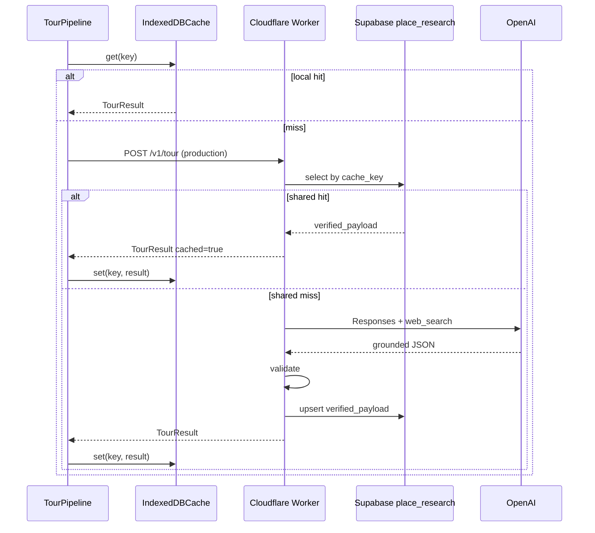

# Supabase shared research cache

**Status:** Wired for project `ifoybmzofjdgekvvrsot`. Run SQL in `supabase/migrations/` once, then paste the anon key in iOS Settings (or set `SUPABASE.anonKey` for web).

**Why:** IndexedDB is **device-local**. The next visitor to Stephansdom should reuse verified facts, not pay for another web_search. Supabase stores **verified research payloads** once per place (plus category/kids variants via cache key).

---

## Principles

1. Cache **verified, validated** tour results only (`status === "ok"` with non-empty `claims.verified`).
2. Never store API keys or raw user prompts with PII beyond place name + coords.
3. Prefer **Worker → Supabase service role** for writes; browser anon key only with strict RLS (read public cache, no arbitrary writes) — or no browser Supabase at all.
4. Leave `SUPABASE.url` / `SUPABASE.anonKey` empty in the repo (`js/config.js`).

---

## Table: `place_research`

Stories / verified tour JSON per building cache key.

## Table: `area_locations`

Notable pins for a map area (center, radius, label). Columns include `places` (JSON array of pin metadata) and the same TTL / cache-key pattern as stories.

```sql
create table if not exists public.area_locations (
  id uuid primary key default gen_random_uuid(),
  cache_key text not null unique,
  center_lat numeric(10, 5) not null,
  center_lng numeric(10, 5) not null,
  radius_meters integer not null,
  area_label text,
  places jsonb not null default '[]'::jsonb,
  pipeline_version text not null,
  model text,
  researched_at timestamptz not null default now(),
  expires_at timestamptz not null,
  hit_count integer not null default 0,
  created_at timestamptz not null default now(),
  updated_at timestamptz not null default now()
);
```

Full migration: [`supabase/migrations/20260819000000_initial_schema.sql`](../../supabase/migrations/20260819000000_initial_schema.sql).

## Table: `place_research`

```sql
create table if not exists public.place_research (
  id uuid primary key default gen_random_uuid(),
  cache_key text not null unique,
  place_id text,                          -- OSM / Wikidata / internal id when known
  geohash text,                           -- optional; or derive from lat/lng
  lat numeric(10, 5),
  lng numeric(10, 5),
  name_normalized text,                   -- lowercased slug for lookup
  entity_type text,
  categories text[] default '{}',         -- sorted category ids
  kids_mode boolean default false,
  verified_payload jsonb not null,        -- full TourResponse (validated)
  sources jsonb default '[]'::jsonb,      -- denormalized citations
  confidence numeric(4, 3),               -- identification or aggregate claim confidence
  pipeline_version text not null,
  researched_at timestamptz not null default now(),
  expires_at timestamptz not null,
  hit_count integer not null default 0,
  created_at timestamptz not null default now(),
  updated_at timestamptz not null default now()
);

create index if not exists place_research_place_id_idx
  on public.place_research (place_id)
  where place_id is not null;

create index if not exists place_research_geo_idx
  on public.place_research (lat, lng);

create index if not exists place_research_expires_idx
  on public.place_research (expires_at);
```

### Optional RLS (public read of non-expired rows)

```sql
alter table public.place_research enable row level security;

-- Example: anon can SELECT non-expired rows only (no INSERT/UPDATE from client)
create policy "public_read_fresh"
  on public.place_research
  for select
  to anon
  using (expires_at > now());

-- Writes: service_role only (Worker)
```

---

## Cache key

Built by `buildCacheKey` / `TourCache.makeKey`:

| Mode | Pattern |
|------|---------|
| With stable id | `gct:v{PIPELINE}:id:{placeId}:{focus}:{cats}:{kids}` |
| With name | `gct:v{PIPELINE}:{lat5}:{lng5}:{nameSlug}:{focus}:{cats}:{kids}` |
| Coords only | `gct:v{PIPELINE}:{lat5}:{lng5}:{focus}:{cats}:{kids}` |

- `lat5` / `lng5` — 5 decimal places (~1 m) for pin stability without over-fragmenting.
- `cats` — sorted comma-separated category ids.
- `kids` — `0` | `1`.
- Bump `PIPELINE_VERSION` (e.g. `2.1.0`) to invalidate globally when schema/prompts break compatibility.

---

## TTL

| Store | Default TTL | Notes |
|-------|-------------|-------|
| IndexedDB (`IndexedDBCache`) | 7 days | Per device |
| Supabase | 14–30 days | Longer for high-confidence famous POIs |
| Needs confirmation / errors | **Do not store** | |

Suggested Worker policy:

- `identification_confidence >= 0.8` and famous/landmark entity → 30 days
- Otherwise → 14 days
- Manual curator refresh → set `expires_at = now()` or delete row

---

## Invalidation

1. **Version bump** — new `PIPELINE_VERSION` in key → natural miss.
2. **Prefix invalidate** — client IndexedDB: `cache.invalidate("gct:v2.1.0:")`.
3. **Shared prefix** — Supabase needs a Worker RPC (`delete from place_research where cache_key like $1`) — browser stub logs a warning.
4. **Single place** — delete by `place_id` or `cache_key`.
5. **TTL expiry** — Worker cron or ignore expired on read.

---

## Read / write flow



**GitHub Pages demo (today):** only `IndexedDBCache`. `SupabaseCache` no-ops until `SUPABASE.url` + `anonKey` are set at runtime (still prefer Worker for writes).

---

## Client adapter

```js
import { createTourCache, SupabaseCache, IndexedDBCache } from "../services/CacheService.js";

// Default: IndexedDB only
const cache = createTourCache();

// Explicit stub (no secrets in repo)
const shared = new SupabaseCache({
  url: "",      // runtime only
  anonKey: "",  // runtime only — prefer Worker
});
```

---

## Cost & ops notes

- One successful research for a landmark can serve thousands of visitors → primary cost lever.
- Store full `verified_payload` jsonb so narration/categories can be re-served without re-calling the model; optional later: store claims-only and regenerate narration cheaply.
- Monitor `hit_count` to justify longer TTL for hot keys.
- Own future DB of curated facts can **seed** `verified_payload` without OpenAI for flagship cities.

---

## What’s next (wiring)

1. Create Supabase project; run SQL above; store URL + **service role** in Worker secrets only.
2. Implement Worker `POST /v1/tour` with cache get → research → validate → upsert.
3. Set client `API.tourEndpoint` to Worker URL; keep browser OpenAI path as demo fallback.
4. Add cron to purge `expires_at < now()`.
5. Optionally map Wikidata / OSM relation ids into `place_id` for stabler keys than lat/lng.
